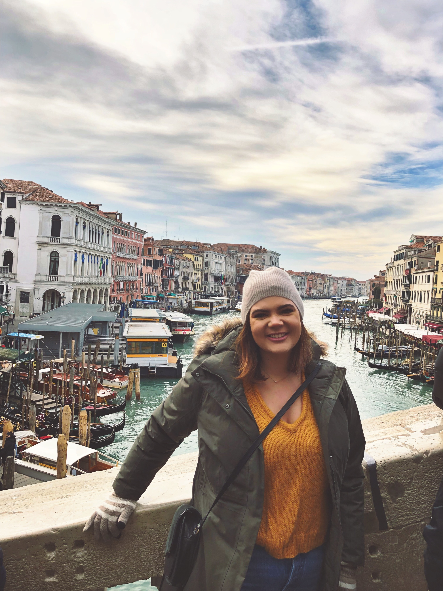

```{r setup, include=FALSE}
knitr::opts_chunk$set(echo = TRUE)
```



I am a second year MPH candidate in the Department of Epidemiology at Columbia Univeristy's Mailman School of Public Health.

You can learn more about my professional experience [here](about.html).